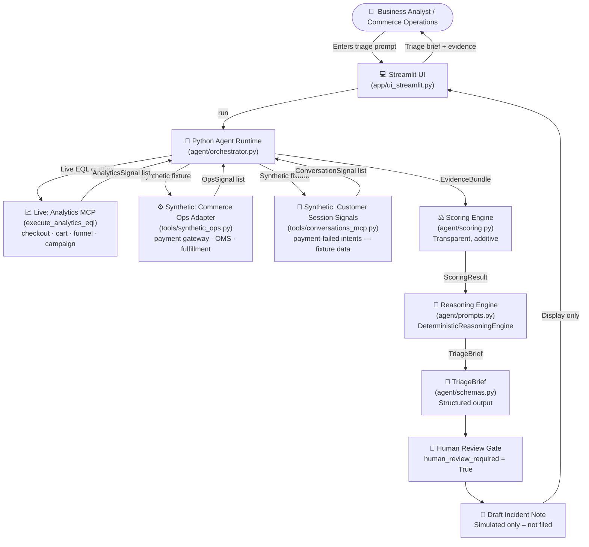

# Architecture – Simons Unified Commerce Signal Agent

## Overview

The agent is a Python pipeline that ingests signals from multiple adapters,
scores the evidence, and produces a structured `TriageBrief` for human review.

The Analytics MCP adapter connects live to Bloomreach Loomi Connect via `execute_analytics_eql`,
including campaign activity evidence. Conversations MCP and Commerce Ops are synthetic fixture
adapters that represent signal sources unavailable in the Bloomreach sandbox.

---

## System Diagram



---

## Component Responsibilities

| Component | File | Responsibility |
|---|---|---|
| Streamlit UI | `app/ui_streamlit.py` | Demo narrative layout, user input, result display |
| Orchestrator | `agent/orchestrator.py` | Pipeline coordination, tool trace |
| Schemas | `agent/schemas.py` | Pydantic models for all data structures |
| Scoring | `agent/scoring.py` | Transparent, additive severity/confidence |
| Reasoning Engine | `agent/prompts.py` | TriageBrief assembly |
| Live MCP Client | `tools/live_mcp_client.py` | Live `stdio_client` executing EQL |
| Live Evidence Adapter | `tools/live_evidence_adapter.py` | Normalizes live bundle into signals |
| Analytics Adapter | `tools/analytics_mcp.py` | Fallback mock analytics signals |
| Conversations Adapter | `tools/conversations_mcp.py` | Load/parse synthetic intent signals |
| Ops Adapter | `tools/synthetic_ops.py` | Load/parse synthetic ops error signals |
| Marketing Adapter | `tools/marketing_mcp_optional.py` | Fallback mock marketing context |

---

## Data Flow

```
User Prompt
  ↓ classify_prompt() – keyword check
  ↓ Analytics MCP (Live execute_analytics_eql or Cache/Demo Fallback)
      → checkout trend, cart trend, funnel, mobile funnel, campaign activity
      → List[AnalyticsSignal]
  ↓ Conversations MCP (Synthetic Fixture — payment-failed intents)
      → List[ConversationSignal]
  ↓ SyntheticOpsClient.get_ops_signals() (Synthetic — payment gateway, OMS)
      → List[OpsSignal]
  ↓ EvidenceBundle (aggregated)
  ↓ score_evidence(bundle) → ScoringResult (severity, confidence, reasoning)
  ↓ DeterministicReasoningEngine.build_triage_brief(...) → TriageBrief
  ↓ Streamlit renders TriageBrief sections
  ↓ Human reviews and decides on action
```

---

## Key Design Decisions

- **Adapter pattern**: Each signal source has a dedicated adapter class with a stable
  public method signature. Replacing mock with real MCP requires changing only the method body.
- **ReasoningEngine protocol**: The reasoning step is behind a `Protocol` so a `GeminiReasoningEngine`
  can be injected without touching the orchestrator (Phase 2).
- **Scoring transparency**: Every severity/confidence point is traceable to a named signal.
  No black-box logic.
- **Safety invariants**: `human_review_required = True` and `simulated_actions_only = True`
  are enforced by both the schema (const fields) and tests.
- **Tool trace**: Every adapter call is logged with status (MOCK/LIVE/SKIPPED) and included
  in the `TriageBrief` for UI display and auditability.
