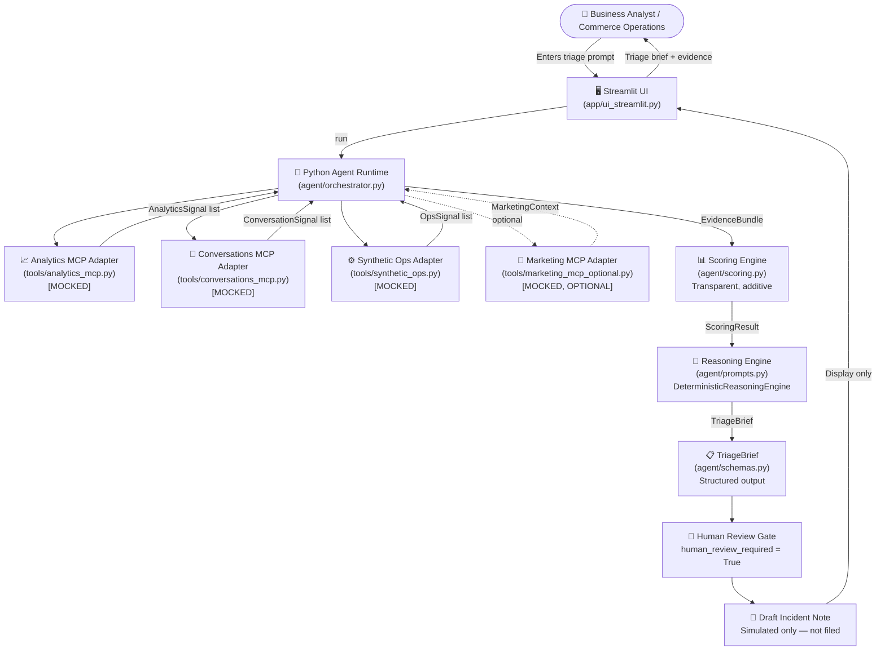

# Architecture — Simons Unified Commerce Signal Agent

## Overview

The agent is a Python pipeline that ingests signals from multiple mock adapters,
scores the evidence, and produces a structured `TriageBrief` for human review.

All MCP adapters are currently mocked with local fixture data.
No real Bloomreach MCP connections exist yet.

---

## System Diagram



---

## Component Responsibilities

| Component | File | Responsibility |
|---|---|---|
| Streamlit UI | `app/ui_streamlit.py` | Demo narrative layout, user input, result display |
| Orchestrator | `agent/orchestrator.py` | Pipeline coordination, tool trace |
| Schemas | `agent/schemas.py` | Pydantic models for all data structures |
| Scoring | `agent/scoring.py` | Transparent, additive severity/confidence |
| Reasoning Engine | `agent/prompts.py` | TriageBrief assembly (DeterministicReasoningEngine) |
| Analytics Adapter | `tools/analytics_mcp.py` | Load/parse analytics signals (mocked) |
| Conversations Adapter | `tools/conversations_mcp.py` | Load/parse conversation intent signals (mocked) |
| Ops Adapter | `tools/synthetic_ops.py` | Load/parse ops error signals (mocked) |
| Marketing Adapter | `tools/marketing_mcp_optional.py` | Load/parse marketing context (mocked, optional) |
| Fixtures | `data/*.json`, `data/*.yml` | Synthetic scenario data |

---

## Data Flow

```
User Prompt
  → classify_prompt() — keyword check
  → AnalyticsMCPClient.get_anomalies() → List[AnalyticsSignal]
  → ConversationsMCPClient.get_intent_signals() → List[ConversationSignal]
  → SyntheticOpsClient.get_ops_signals() → List[OpsSignal]
  → MarketingMCPClientOptional.get_context() → Optional[MarketingContext]
  → EvidenceBundle (aggregated)
  → score_evidence(bundle) → ScoringResult (severity, confidence, reasoning)
  → DeterministicReasoningEngine.build_triage_brief(...) → TriageBrief
  → Streamlit renders TriageBrief sections
  → Human reviews and decides on action
```

---

## Key Design Decisions

- **Adapter pattern**: Each signal source has a dedicated adapter class with a stable
  public method signature. Replacing mock with real MCP requires changing only the method body.
- **ReasoningEngine protocol**: The reasoning step is behind a `Protocol` so a `GeminiReasoningEngine`
  can be injected without touching the orchestrator (Phase 2).
- **Scoring transparency**: Every severity/confidence point is traceable to a named signal.
  No black-box logic.
- **Safety invariants**: `human_review_required = True` and `simulated_actions_only = True`
  are enforced by both the schema (const fields) and tests.
- **Tool trace**: Every adapter call is logged with status (MOCK/LIVE/SKIPPED) and included
  in the `TriageBrief` for UI display and auditability.
